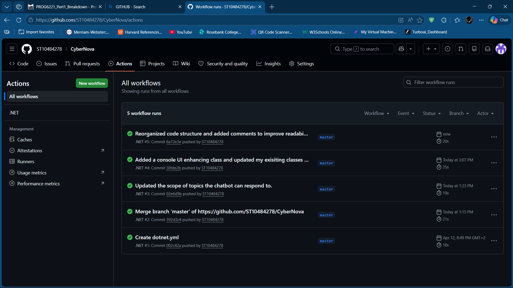

# CyberNova Cybersecurity Chatbot 

## Overview

The **CyberNova Cybersecurity Chatbot** is a console-based application developed in C#. The chatbot is designed to educate users about cybersecurity concepts and promote safe online behavior. It interacts with users through a text-based interface, processes their input, and provides relevant responses based on cybersecurity topics such as phishing, password security, malware, ransomware, and online privacy.

The system demonstrates core programming principles including input handling, conditional logic, modular design, exception handling, and user interface enhancements within a console environment.

---

## Purpose of the Chatbot

The primary purpose of the CyberNova chatbot is to:

* Raise awareness about cybersecurity threats
* Provide basic cybersecurity education
* Simulate human-like conversation using delays and formatted output
* Demonstrate programming concepts in a practical application
* Improve user interaction through a structured console interface

This chatbot serves as an educational tool that helps users understand how to protect themselves from common online risks.

---

## Key Features

### 1. User Interaction System

The chatbot accepts user input from the console and responds based on recognized keywords. It supports continuous interaction using a loop until the user chooses to exit the program.

### 2. Cybersecurity Knowledge Base

The chatbot includes predefined responses related to cybersecurity topics such as:

* Phishing attacks
* Password safety
* Suspicious links and URLs
* Malware and viruses
* Ransomware
* Online scams
* Privacy protection
* Safe browsing practices

### 3. Help Menu

Users can type:

help

to display a list of supported topics and commands.

### 4. Exit Command

Users can type:

exit

to safely terminate the chatbot session.

### 5. Audio Greeting

When the application starts, it attempts to play a greeting sound file using the SoundPlayer class. If the file is missing or cannot be played, the program handles the error gracefully.

### 6. Enhanced Console User Interface

The chatbot includes visual improvements to enhance readability and user experience, such as:

* Colored text output (red theme)
* Section headers and dividers
* ASCII art banner
* Spacing and formatting
* Symbols for prompts
* Simulated typing delays using Thread.Sleep()

### 7. Input Validation

The program checks for empty or invalid input and prompts the user to enter a valid question.

---

## How the Chatbot Works

The chatbot follows a simple input-processing-response workflow:

1. The program starts and displays a welcome message.
2. The user enters their name.
3. The chatbot plays a greeting sound.
4. The user types a message.
5. The chatbot converts the input to lowercase.
6. The system checks the input against predefined keywords.
7. A matching response is returned.
8. The conversation continues until the user types "exit".

---

## Program Structure

The chatbot is organized using classes to separate responsibilities and improve maintainability.

### 1. Program Class

The Program class serves as the entry point of the application.

Responsibilities:

* Starts the application
* Creates the chatbot object
* Plays greeting audio
* Displays instructions
* Handles the conversation loop
* Ends the program when the user exits

Main Method Tasks:

* Initialize chatbot
* Display welcome interface
* Request user name
* Process user input
* Display chatbot responses

---

### 2. CyberNovaBot Class

The CyberNovaBot class contains the core logic of the chatbot.

Responsibilities:

* Process user input
* Match keywords to responses
* Provide cybersecurity information
* Display help menu
* Play greeting audio
* Handle errors

Key Methods:

PlayGreetingAudio()

* Locates the greeting audio file
* Verifies file existence
* Plays the sound
* Handles exceptions

GetResponse()

* Receives user input
* Converts input to lowercase
* Matches keywords using conditional statements
* Returns the appropriate response

ShowHelpMenu()

* Displays supported topics
* Provides user guidance

---

## Technologies Used

Programming Language:

* C#

Development Environment:

* Visual Studio

Libraries and Namespaces:

System
Used for console input and output.

System.Media
Used to play audio files.

System.IO
Used for file handling and path management.

System.Threading
Used to create delays and simulate typing.

---

## Object-Oriented Programming Concepts Used

### Classes

The program uses multiple classes to organize functionality.

Examples:

Program
CyberNovaBot
ConsoleUI (if implemented)

### Methods

Methods are used to perform specific tasks such as:

* Playing audio
* Processing user input
* Displaying messages
* Showing help information

### Encapsulation

Each class manages its own responsibilities, keeping code organized and modular.

---

## User Interface Design

The console interface was enhanced to improve usability and readability.

Design elements include:

* Colored text output
* Structured layout
* Section headers
* Divider lines
* Clear prompts
* Visual spacing
* Typing animation delays

These features create a more engaging and professional user experience.

---

## Error Handling

The chatbot includes exception handling to prevent program crashes.

Example:

If the audio file cannot be found or played, the program:

* Displays an error message
* Continues running safely

This improves system reliability.

---

## Example User Interaction

User:

Hello

Chatbot:

Hello! I am CyberNova, your cybersecurity assistant.

User:

What is phishing?

Chatbot:

Phishing emails try to trick you into giving personal information. Always verify the sender and avoid clicking suspicious links.

User:

Thanks

Chatbot:

You're welcome! Let me know if you need more help staying safe online.

---

## Future Improvements

The chatbot can be expanded with additional features such as:

* Graphical User Interface (GUI)
* Database storage for chat history
* Natural language processing (NLP)
* Sentiment analysis
* User authentication
* Logging system
* More cybersecurity topics
* Voice recognition
* Internet-based threat updates

---

## Conclusion

The CyberNova Cybersecurity Chatbot demonstrates fundamental programming and software development concepts through a practical cybersecurity education tool. It combines user interaction, structured logic, and enhanced console design to create an engaging and informative application.

The project highlights skills in:

* C# programming
* Problem solving
* User interface design
* Code organization
* Input handling
* Error management
* Software documentation

## Chatbot Screenshot

